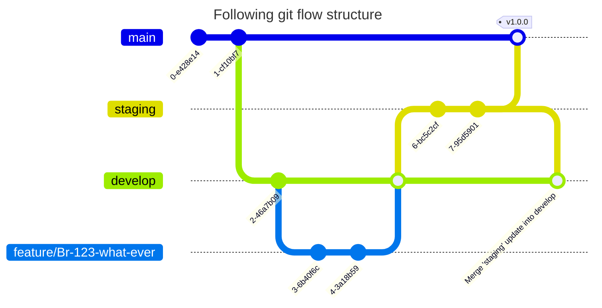

# Buscorepuesto website

We have decided to change the website to a new one, this time we are going to use Next.js, a React framework that allows
us to create a website with a better performance and SEO.

## Getting Started

We will use pnpm as package manager, you can install it with the following command:
To run the server we will use the following command:

```bash
$ pnpm install
$ pnpm run dev
```

Open [http://localhost:3000](http://localhost:3000) with your browser to see the result.

## Technologies

We are going to use the following technologies:

- Next.js
- React
- Tailwind CSS
- TypeScript
- ESLint
- Prettier

## Architecture

About the architecture, we are going to follow the screaming architecture, which is a way to organize the code allow it
to scream what it is and what is use for.

So, for example, something similiar to this structure is what we here below:

```bash
└── src
    ├── assets
    └── modules
        ├── about
        ├── articles
        │   ├── components
        │   ├── design
        │   ├── hooks
        │   ├── lib
        │   ├── services
        │   └── states
        ├── auth
        ├── core
        │   ├── components
        │   ├── design
        │   ├── hooks
        │   ├── lib
        │   ├── services
        │   └── states
        └── payments
```

Also we will follow convention from next.js to keep our structure clean and easy to understand.

## Code Style

We are going to use ESLint and Prettier to keep our code clean and easy to read. So make you have everything well
indented
and with the correct format.

## Branches

We are going to use the following branches:



All commits need to follow conventional commits, you can find more information
here: https://www.conventionalcommits.org/en/v1.0.0/

## Deploy

Now we can deploy by branch, develop and production environments. The branch environment is deployed automatically when
a PR is merged into the branch.

For production, we will do an automatic deployment, means like, every 2 weeks we will deploy the changes that we have in
master/main branch.

That means that everything that we need try to get accepted all staging changes in production before production
automatic deployment.


